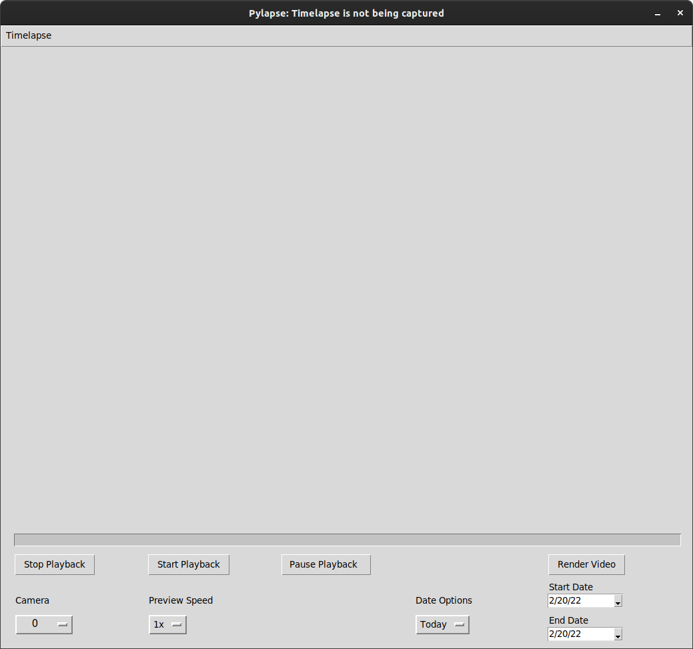
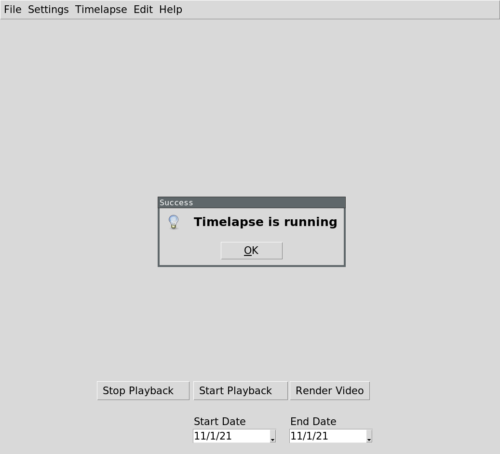

## Pylapse
Pylapse is a GUI frontend for ffmpeg written in Python 3. It enables novice users to start easily capturing jpeg images from RTSP (x264) enabled cameras, save them locally and render a quick video out of them all using Pylapse. Currenttly additional bash scripts are also used alongside the python code.

## Features

- Capture and playback images from x264 RTSP enabled cameras
- Render video given selected dates
- Supports multiple IP cameras
- Multiple playback speed options
- Timelapse running even if application is accidentally closed
- Start/End time of time-lapse (e.g. always start at 7am and end at 7PM)


## Screenshots



## Installation on Ubuntu 21.04

```
sudo apt-get install ffmpeg -y
sudo apt-get install python3-pip -y
sudo apt-get install python3-tk -y
sudo apt-get install python3-pil python3-pil.imagetk -y
pip install opencv-python
pip install tkcalendar
pip install requests
pip install --upgrade psutil
```

## Running 
`python3 pylapse.py`

## Setting Up

Navigate to the Timelapse and then Settings Menu option. When clicking on it a new window wil appear that looks like so:



Fill in the information that is relevant to you e.g. you camera IPs (make sure they are static IPs such that they don't change), and their credentials. Make sure your settings are comma seperated and that all fields are populated as shown in the screenshot. Click Save and wait for Pylapse to make some nessesary checks. Note that if you have multiple cameras this may take a while since the code checks if every camera is reachable via RTSP.


## Starting Timelapse
To start capturing pictures it is as simple as navigating to the Timelapse and then Start Menu option. Again this step may take a while to repond since Pylapse checks again if every camera is reachable via RTSP. After that pictures will start being captured according to the chosen settings.


