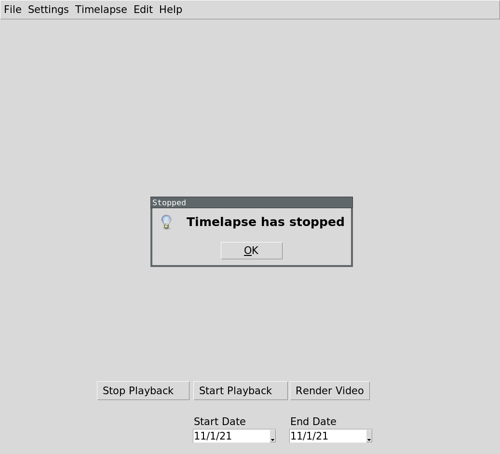
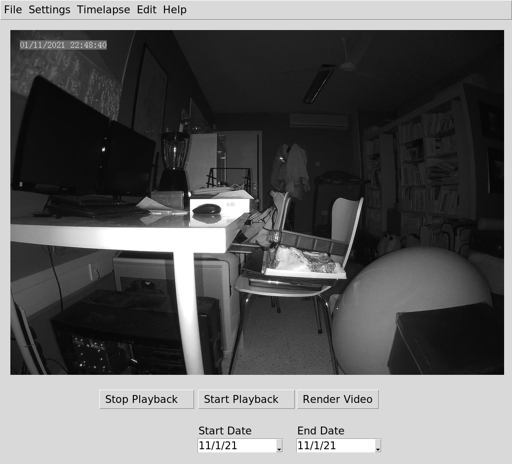
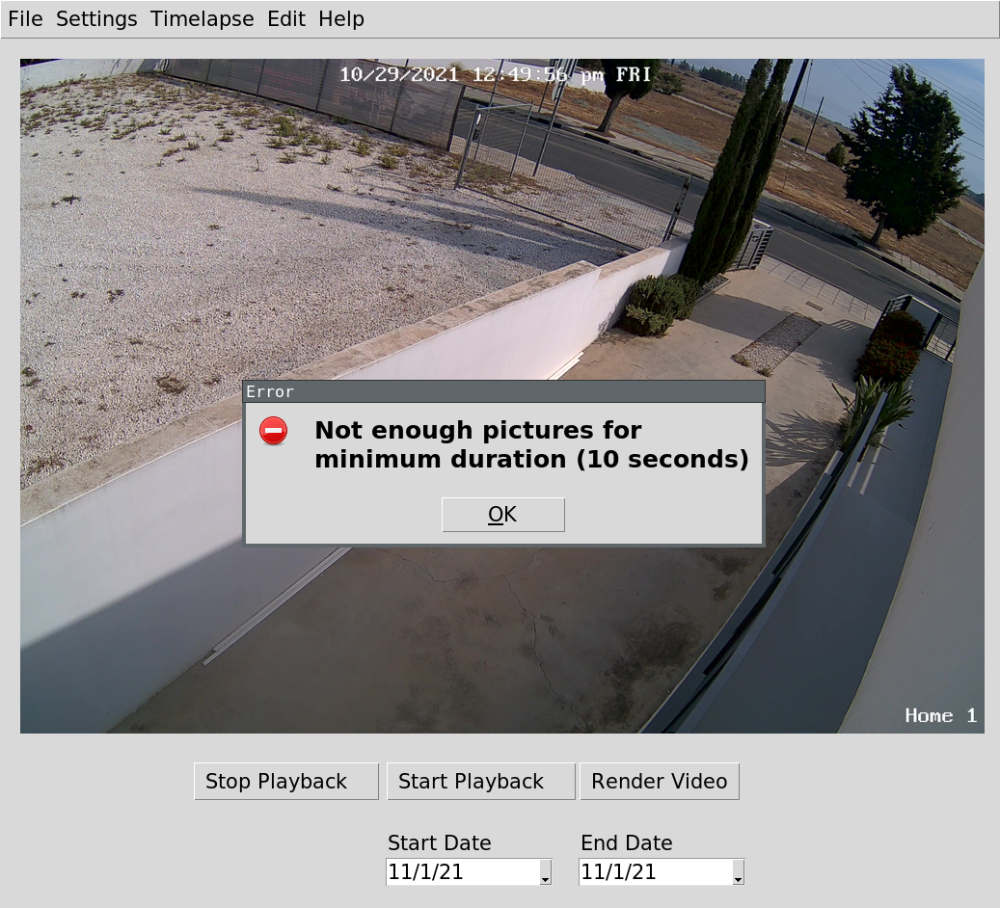
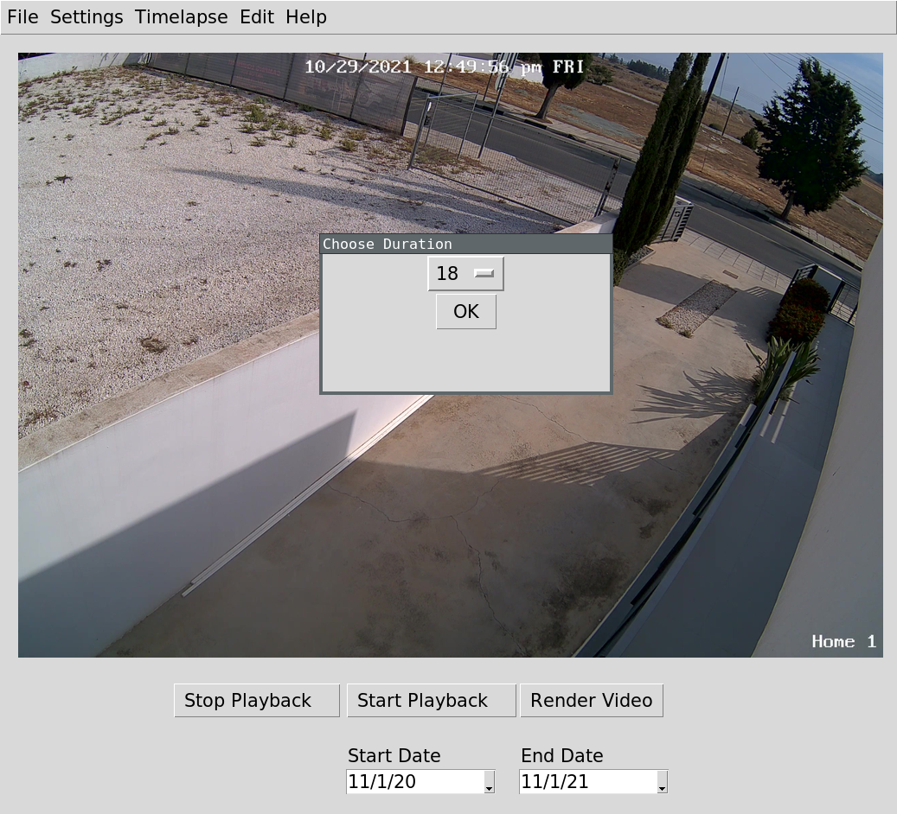
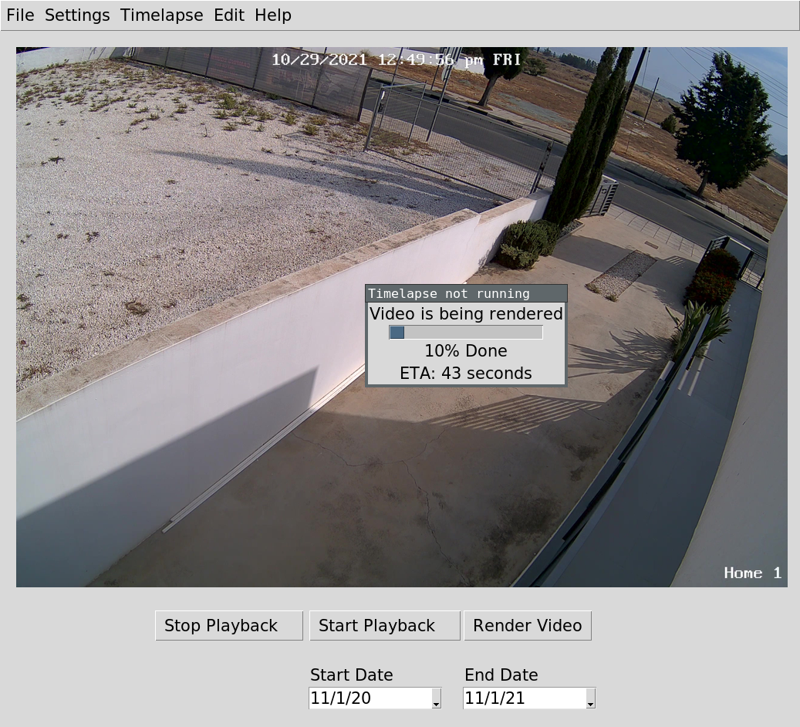
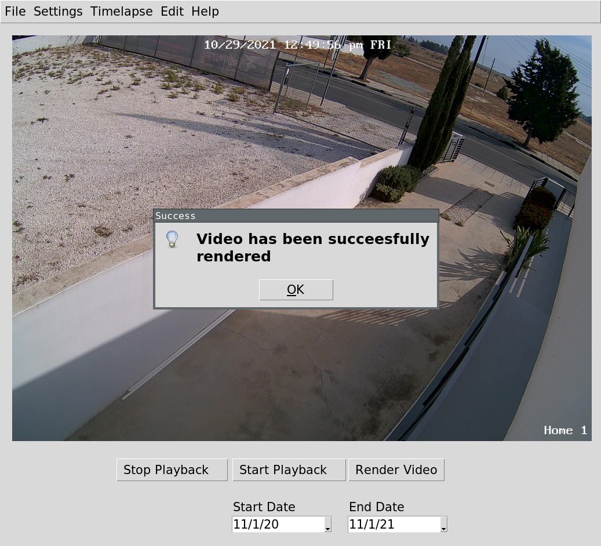

## Pylapse
PyLapse is a GUI frontend written in Python 3 using the tkinter GUI framerwork. It is a frontend for the popular command line utility ffmpeg. It enables novice users to start easily capturing jpeg images from RTPS x264 enabled cameras, save them locally and render a quick video out of them all using PyLapse alone.

## Features

- Capture and playback images from x264 RTSP enabled cameras
- Render video given selected dates
- Supports multiple cameras
- Password protected timelapse settings
- Multiple playback speed options
- Playback progress bar
- Timelapse running even if application is accidentally closed
- Start/End time of time-lapse (e.g. always start at 7am and end at 7PM)
- Notify by email when timelapse stops working


## Screenshots

   
   


## Installation on Ubuntu 21.04

```
sudo apt-get install ffmpeg -y
sudo apt-get install python3-pip -y
sudo apt-get install python3-tk -y
sudo apt-get install python3-pil python3-pil.imagetk -y
pip install opencv-python
pip install tkcalendar
pip install requests
pip install --upgrade psutil
pip3 install yagmail[all]
```

## Store gmail credentials on keyring

### Step 1: Open a python3 interpreter

### Step 2: Execute the following

```
import yagmail
yagmail.SMTP('mygmailusername').send('to@someone.com', 'subject', 'This is the body')
```

### Step 3: Enter email password when prompted


### Step 3: Choose y when prompted to save the credentials on keyring


## Running 

`python3 main.py`

